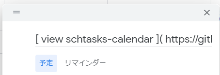
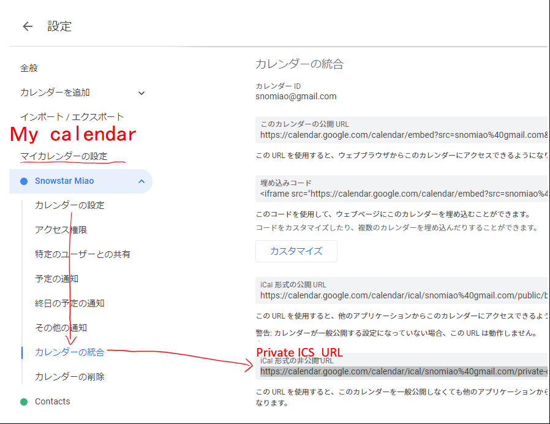

# schtasks-calendar (or schcal)

Synchronizes (or clones) Google Calendar events containing a markdown link to Windows Task Scheduler to automatically open the link on time on your PC.

ARCHIVED: This repo has moved into part of [snomiao/js](https://github.com/snomiao/js)

## Get Started

### 1. Add events to Google Calendar (let's say, in the next few days).

Type into the title field in the following format:

- `[ ...taskname ]( ...link )`
- `[ ...taskname ]( ...local_application_path )`

Example:

- `[ view schtasks-calendar ]( https://github.com/snomiao/schcal )`

  

### 2. Then go to the settings for the particular calendar (in the hamburgur menu on the left), or go to `Settings for my calendars` section (in the main settings) for the particular calendar to be exported.


Scroll down and copy the private ics url



And you should get the ics url https://calendar.google.com/calendar/ical/xxxxxxxxxxxxxxxxxxx/private-cxxxxxxxxxxxxxxxxxxxxxxxxxxxxxxx/basic.ics
Copy and save it for step 3.

### 3. Then run using the command parameters.

```sh
npx schcal YOUR_ICS_URL
```

Example:

```sh
npx schcal https://calendar.google.com/calendar/ical/xxxxxxxxxxxxxxxxxxx/private-cxxxxxxxxxxxxxxxxxxxxxxxxxxxxxxx/basic.ics
```

You should see this


### 4. Check your schtasks

Press `Win + R` and type `taskschd.msc` to open Windows Task Scheduler


The task `SSAC-0820-0530-view schtasks-calendar-XXXXXX` corresponds to the event you just added to Google Calendar and the link contained will be opened on time.

### 5. Configure schtasks auto update (daily or whenever)

If you want to keep using this, you can configure the auto update (daily or whenever).

1. Run `mkdir schcal` in command line to create a directory.
2. Write the following to the config file
   `~/.schcal/config.yaml`

```yaml
ICS_URLS:
  - https://calendar.google.com/calendar/ical/xxxxxxxxxxxxxxxxxxx/private-cxxxxxxxxxxxxxxxxxxxxxxxxxxxxxxx/basic.ics
```

3. Write the following to the batch file
   `schcal/on-schtask.bat`

```bat
cd %~dp0
npx schcal > ./schcal.log
schtasks /Create /tn SSAC /sc daily /st 17:00 /tr %0 /F
```

4. Then run `on-schtask.bat` which will update your tasks at 17:00 every day (you can change this by editing the bat file)

5. Then run `schtasks /Run /tn SSAC` to test schtasks.

## Other Methods

### Run using command line.

```sh
npx schcal https://calendar.google.com/calendar/ical/xxxxxxxxxxxxxxxxxxx/private-cxxxxxxxxxxxxxxxxxxxxxxxxxxxxxxx/basic.ics
```

Or

```sh
npm i schtasks-calendar -g
schcal https://calendar.google.com/calendar/ical/xxxxxxxxxxxxxxxxxxx/private-cxxxxxxxxxxxxxxxxxxxxxxxxxxxxxxx/basic.ics
```

### Run using `config.yaml`

Make a `config.yaml` like this

```yaml
# Your ics urls, the order is not important
ICS_URLS:
  # snomiao's private calendar ( demo )
  - https://calendar.google.com/calendar/ical/snomiao%40gmail.com/private-d772b2790a1a73de26afb64188c5ca0a/basic.ics
  # a calendar
  - https://calendar.google.com/calendar/ical/xxxxxxxxxxxxxxxxxxx/private-cxxxxxxxxxxxxxxxxxxxxxxxxxxxxxxx/basic.ics
  # another calendar
  - https://calendar.google.com/calendar/ical/xxxxxxxxxxxxxxxxxxx/private-cxxxxxxxxxxxxxxxxxxxxxxxxxxxxxxx/basic.ics

# Optional, if you want cache the ics file (usually for debuging)... default value is 0 (no cache and never save a cache file)
# CACHE_TIMEOUT: 3600e3 # one hour

# Optional, if you need a proxy for Google... Otherwise you can delete this line. Default value is empty.
HTTP_PROXY: http://localhost:1080

# Optional, how many days events will add to schtasks, default value is 7 (then this program will )
FORWARD_DAYS: 7 # TODO: NEED TO DRAW A DIAGRAM TO EXPLAIN THIS
```

and run

```sh
npx schcal
```

in the working directory containing `config.yaml` .

## Supported formats

You can put _one_ link (for now, support for multiple links in development) of the following into the title or description fields of events to be launched as scheduled.

1. Web Links: `http://...` , `https://...` , `ftp://...` , `file://...`
2. Markdown Links: `[ ... ]( ... )`
3. Run Command: `RUN ...`

(supports urls, custom protocols and local files)

## TODOS

- [ ] Translate this into chinese version README.md
- [x] An wrapper CMD file.is needed to solving the error from `schtasks.exe` `ERROR: Value for '/TR' option cannot be more than 261 character(s).`

## Q & A

- Q: I saw "Unexpected token ." when using `npx schcal`.
- A: You need to update your Nodejs to higher than v14.8.0 [Click to download](https://nodejs.org/en/download/)

## References and further readings

- [schtasks | Microsoft Docs](https://docs.microsoft.com/en-us/windows-server/administration/windows-commands/schtasks)
- [手把手教你使用 nodejs 编写 cli(命令行) - 掘金](https://juejin.im/post/6844903702453551111)
- [PC Automation - IFTTT](https://ifttt.com/applets/190903p-pc-automation)
- [Monkai - Your Digital Wellbeing Assistant](https://monkai.io/)
