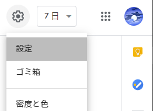

# schtasks-calendar (或 schcal)

同步（或克隆）包含 markdown 链接的 Google 日历事件到 Windows 任务调度程序，以在您的 PC 上及时自动打开链接。

只需簡単幾歩，你就可以在你的 PC 上編排何時自动打开链接。

## 开始使用

### 1. 在 Google 日历中添加事件（比如说，在接下来的几天内）。

在以下格式中输入标题字段：

- `[ ...任务名称 ]( ...链接 )`
- `[ ...任务名称 ]( ...本地应用程序路径 )`

示例：

- `[ 查看 schtasks-calendar ]( https://github.com/snomiao/schcal )`

  

### 2. 然后转到特定日历的设置（在左边的汉堡菜单中），或转到`我的日历设置`部分（在主设置中）以导出特定的日历。



向下滚动并复制私有 ics 网址


然后你就应该得到 ics 网址 https://calendar.google.com/calendar/ical/xxxxxxxxxxxxxxxxxxx/private-cxxxxxxxxxxxxxxxxxxxxxxxxxxxxxxx/basic.ics
复制并保存用于步骤 3。

### 3. 然后使用命令参数运行。

```sh
npx schcal YOUR_ICS_URL
```

示例：

```sh
npx schcal https://calendar.google.com/calendar/ical/xxxxxxxxxxxxxxxxxxx/private-cxxxxxxxxxxxxxxxxxxxxxxxxxxxxxxx/basic.ics
```

你应该看到这个


### 4. 检查你的 schtasks

按 `Win + R` 并输入 `taskschd.msc` 来打开 Windows 任务调度程序


任 `SSAC-0820-0530-view schtasks-calendar-XXXXXX` 对应于你刚刚添加到 Google 日历的事件，其中包含的链接将在预定时间内被打开。

### 5. 配置 schtasks 自动更新（每天或任何时候）

如果你想继续使用这个，你可以配置自动更新（每天或任何时候）。

1. 在命令行中运行 `mkdir schcal` 创建一个目录。
2. 将以下内容写入配置文件
   `~/.schcal/config.yaml`

```yaml
ICS_URLS:
  - https://calendar.google.com/calendar/ical/xxxxxxxxxxxxxxxxxxx/private-cxxxxxxxxxxxxxxxxxxxxxxxxxxxxxxx/basic.ics
```

3. 将以下内容写入批处理文件
   `schcal/on-schtask.bat`

```bat
cd %~dp0
npx schcal > ./schcal.log
schtasks /Create /tn SSAC /sc daily /st 17:00 /tr %0 /F
```

4. 然后运行 `on-schtask.bat`，这样将在每天 17:00 更新你的任务（你可以通过编辑 bat 文件来改变这个）

5. 然后运行 `schtasks /Run /tn SSAC` 来测试 schtasks。

## 其他方法

### 使用命令行运行。

```sh
npx schcal https://calendar.google.com/calendar/ical/xxxxxxxxxxxxxxxxxxx/private-cxxxxxxxxxxxxxxxxxxxxxxxxxxxxxxx/basic.ics
```

或

```sh
npm i schtasks-calendar -g
schcal https://calendar.google.com/calendar/ical/xxxxxxxxxxxxxxxxxxx/private-cxxxxxxxxxxxxxxxxxxxxxxxxxxxxxxx/basic.ics
```

### 使用 `config.yaml` 运行

如下制作一个 `config.yaml`

```yaml
# 你的 ics 网址，顺序不重要
ICS_URLS:
  # snomiao 的私有日历（演示）
  - https://calendar.google.com/calendar/ical/snomiao%40gmail.com/private-d772b2790a1a73de26afb64188c5ca0a/basic.ics
  # 一个日历
  - https://calendar.google.com/calendar/ical/xxxxxxxxxxxxxxxxxxx/private-cxxxxxxxxxxxxxxxxxxxxxxxxxxxxxxx/basic.ics
  # 另一个日历
  - https://calendar.google.com/calendar/ical/xxxxxxxxxxxxxxxxxxx/private-cxxxxxxxxxxxxxxxxxxxxxxxxxxxxxxx/basic.ics

# 可选，如果你想缓存 ics 文件（通常用于调试）...默认值是 0（无缓存且从不保存缓存文件）
# CACHE_TIMEOUT: 3600e3 # 一个小时

# 可选，如果你需要一个代理来使用 Google...否则你可以删除这一行。 默认值为空。
HTTP_PROXY: http://localhost:1080

# 可选，将添加多少天的事件到 schtasks，默认值是 7（然后这个程序将）
FORWARD_DAYS: 7 # TODO: 需要画图解释这个
```

然后运行

```sh
npx schcal
```

在包含 `config.yaml` 的当前目录中。

## 支持的格式

你可以将下面的其中一个链接（目前，多个链接的支持正在开发中）添加到事件的标题或描述字段中，以便按计划启动。

1. 网页链接：`http://...` , `https://...` , `ftp://...` , `file://...`
2. Markdown 链接：`[ ... ]( ... )`
3. 运行命令：`RUN ...`

（支持 urls，自定义协议和本地文件）

## 接下来的任务

- [ ] 将这个翻译成中文版本的 README.md
- [x] 需要一个包装 CMD 文件来解决来自 `schtasks.exe` `ERROR: Value for '/TR' option cannot be more than 261 character(s).` 的错误。

## 问与答

- 问：我在使用 `npx schcal` 时看到 "Unexpected token ."
- 答：你需要更新你的 Nodejs 到高于 v14.8.0 [点击下载](https://nodejs.org/en/download/)

## 参考和进一步阅读

- [schtasks | Microsoft 文档](https://docs.microsoft.com/en-us/windows-server/administration/windows-commands/schtasks)
- [手把手教你使用 nodejs 编写 cli(命令行) - 掘金](https://juejin.im/post/6844903702453551111)
- [PC 自动化 - IFTTT](https://ifttt.com/applets/190903p-pc-automation)
- [Monkai - 你的数字福祉助手](https://monkai.io/)

## 关于

### 许可

GPLv3 - [GNU 公共许可证 v3.0 - GNU 项目 - 自由软件基金会](https://www.gnu.org/licenses/gpl-3.0.en.html)

### 作者

作者：snomiao <snomiao@gmail.com>
网站：[snomiao.com](https://snomiao.com)

### 赞助商

- 还没有。

通过捐赠给 snomiao <[电子邮件：snomiao@gmail.com](mailto:snomiao@gmail.com)>认领你的赞助。

### 参与贡献

主要仓库在[这里](https://github.com/snomiao/js#readme)，欢迎提出任何问题和 PR。
